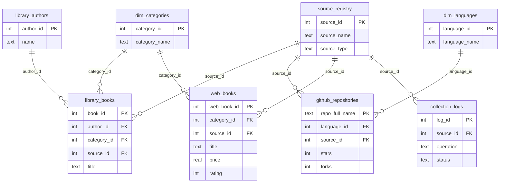

# Book Market Intelligence System

## What It Does

`final_project.py` builds an end-to-end pipeline that collects and integrates data from:

1. **Database**: `notebooks/library.db`
2. **API**: GitHub Search API 
3. **Web**: [books.toscrape.com](http://books.toscrape.com) categories

The pipeline stores everything in `market_intelligence.db`, exports CSV snapshots, and creates `analysis.html` with visual insights.

## Installation

Use Python 3.10+ and install dependencies:

```bash
pip install pandas requests beautifulsoup4 lxml matplotlib openpyxl
```

## How To Run

From the project root:

```bash
python final_project.py
```

## Generated Outputs

- `market_intelligence.db` (integrated database)
- `analysis.html` (executive summary + insights + visualizations)
- `analysis_assets/*.png` (at least 5 charts)
- `exports/*.csv` (all pipeline tables)
- `pipeline.log` (pipeline execution logs)

## Architecture

The `DataCollectionPipeline` class has these stages:

1. **Initialize**: open SQLite connection, setup logger, create schema
2. **Collect from DB**: ingest authors + books + borrowing/fine stats
3. **Collect from API**: query GitHub repositories and normalize language dimension
4. **Collect from Web**: scrape selected categories with validation + robots check
5. **Export & Analyze**: export tables and generate HTML report with visualizations

## Data Schema Diagram



## Notes

- Web scraping respects `robots.txt` checks before category scraping.
- API calls include retry/backoff behavior.
- Data validation is applied for scraped books and repository records.
