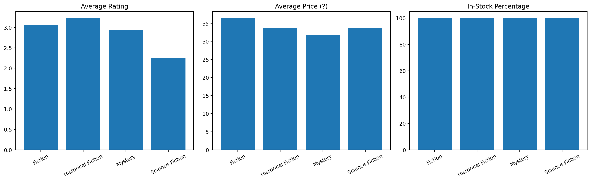

# README for `book_scaper.py`

## Dependencies

Install Python 3.9+ and required libraries:

```bash
pip install requests pandas beautifulsoup4 lxml matplotlib openpyxl
```

## Run `book_scaper.py`

From project root:

```bash
python notebooks/book_scaper.py
```

From `notebooks/` folder:

```bash
python book_scaper.py
```

## Generated Files

Running the script produces:

- `task1_travel_books.csv`
- `task1_analysis.txt`
- `task2_categories.csv`
- `task2_comparison.png`
- `task3_books.csv`
- `task3_books.xlsx`
- `task3_books.json`
- `task3_summary.txt`
- `progress.json`
- `scraper.log`

## Insights

- Average travel-book price: `39.79`
- Number of 5-star books: `1`
- In-stock percentage reported: `1.00%` 

- Books per category:
- `Mystery`: `52`
- `Science Fiction`: `48`
- `Fantasy`: `48`

Category comparison :
- Highest average rating: `Historical Fiction` (`3.23`)
- Highest average price: `Fiction` (`36.46`)
- Category means:
- `Fiction`: avg price `36.46`, avg rating `3.05`
- `Historical Fiction`: avg price `33.64`, avg rating `3.23`
- `Mystery`: avg price `31.72`, avg rating `2.94`
- `Science Fiction`: avg price `33.80`, avg rating `2.25`


